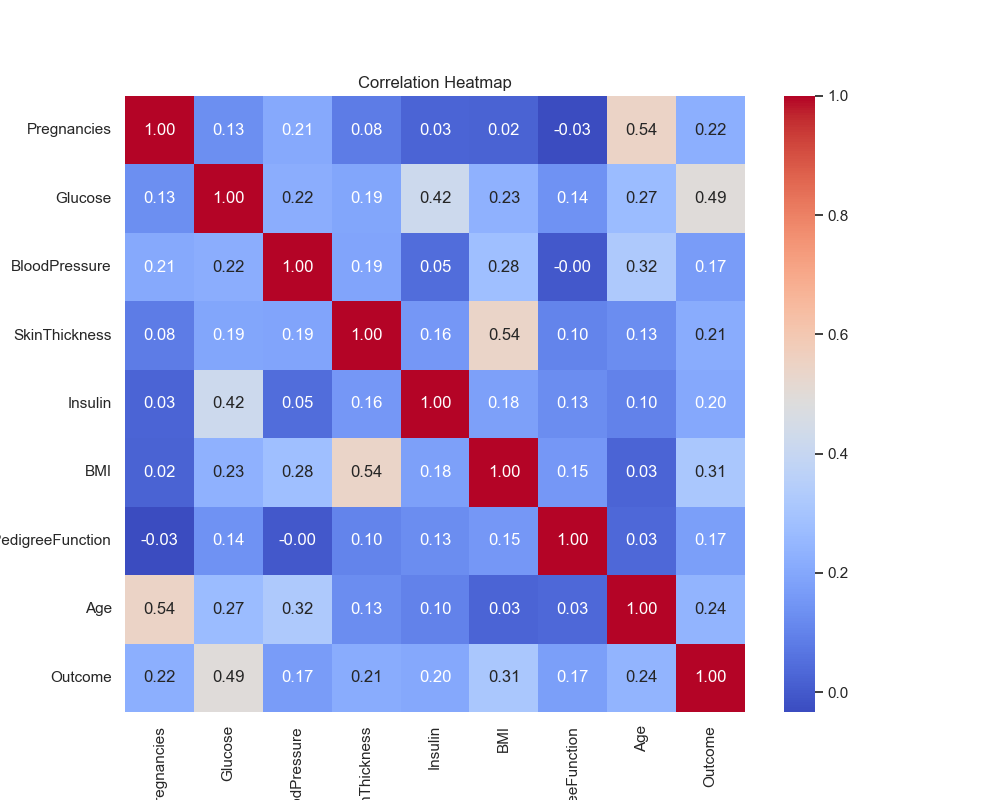
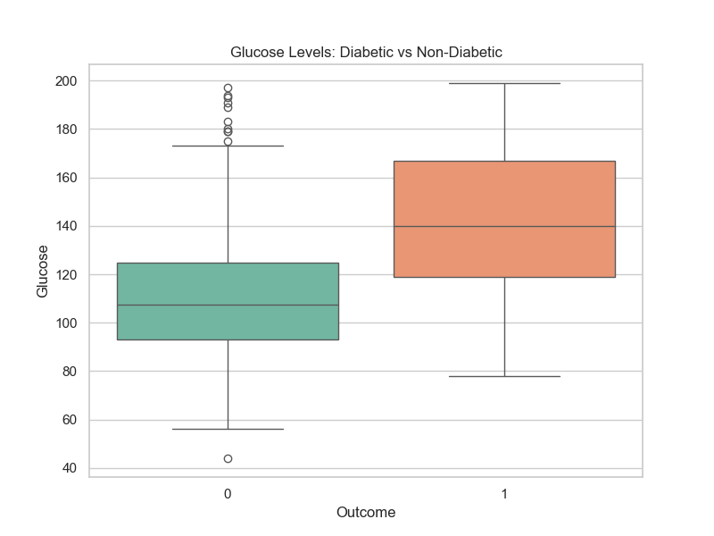

# 🩺 Diabetes Prediction & Analytics Dashboard

A Machine Learning web application that predicts the likelihood of diabetes in patients using the **Pima Indians Diabetes Database**. 

This project implements a complete end-to-end pipeline: **Data Cleaning → Visualization → Model Training → Interactive UI**.

## 🚀 Live Demo
*(If you deploy to Streamlit Cloud, paste your link here. e.g., https://share.streamlit.io/your-username/repo-name)*

## 🧠 Project Highlights
Unlike standard prediction projects, this application implements **two contrasting Machine Learning approaches** to validate results:

1.  **Supervised Learning (Random Forest):**
    * Trains on labeled historical data.
    * Provides a direct "Diabetic" vs "Healthy" classification.
    * **Accuracy:** ~76% (Evaluation on test set).
2.  **Unsupervised Learning (K-Means Clustering):**
    * Analyzes patterns *without* knowing the medical diagnosis.
    * Groups patients into "clusters" based on mathematical similarity.
    * **Result:** Successfully identified a "Diabetic-like" cluster, validating that the disease has a distinct mathematical signature.

## 🛠️ Tech Stack
* **Language:** Python 3.9+
* **Frontend:** [Streamlit](https://streamlit.io/) (for the interactive dashboard)
* **ML Libraries:** Scikit-Learn, Pandas, NumPy
* **Visualization:** Matplotlib, Seaborn

## 📂 Project Structure
```text
├── app.py                   # The main Streamlit web application
├── step1_clean_viz.py       # Script for data cleaning & generating plots
├── save_all_models.py       # Script to train and save ML models
├── diabetes.csv             # Raw dataset
├── diabetes_cleaned.csv     # Processed dataset (generated)
├── all_models.pkl           # Saved models (generated)
├── requirements.txt         # List of dependencies
└── assets/
    └── images/              # Visualizations used in the report & app
## 📊 Visualizations

The project generates several insights into the data:

**Correlation Heatmap**  
**Glucose vs Outcome**




---

## ⚙️ How to Run Locally

### 1. Clone the Repository
```bash
git clone https://github.com/YOUR_USERNAME/diabetes-prediction-app.git
cd diabetes-prediction-app
